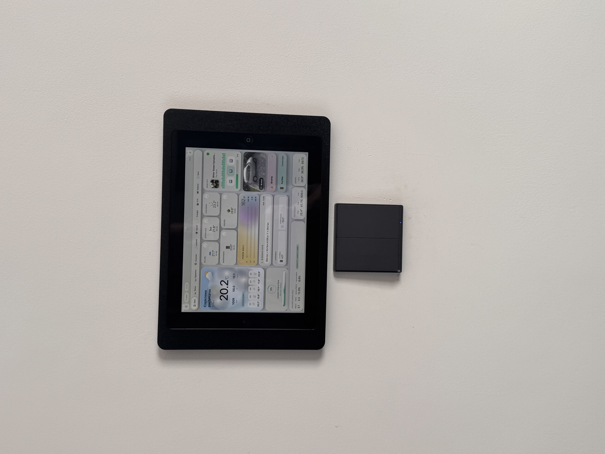

# Home Assistant Dashboard for iPad 4 (iOS 10.3.3)

**Aktualna wersja:** `v11.12.0` — [`ipad.html`](ipad.html) + [`ipad.css`](ipad.css) · [CHANGELOG](CHANGELOG.md) · [TESTING](TESTING.md)


[Wersja polska](#wersja-polska) | [English Version](#english-version)

---

## Wersja Polska

### O Projekcie
Lekki pulpit Home Assistant dla **iPad 4 (iOS 10.3.3)** — czysty **HTML5, CSS3, ES5**, bez frameworków.

### Główne Funkcje
* **Wydajność** — polling tylko wybranych encji (`filter_entity_id`), brak ciężkich frameworków.
* **iOS 10** — fallback CSS bez `backdrop-filter`, kompatybilny JS.
* **REST API** — stany, sterowanie, kamery MJPEG, Spotify (WebSocket fallback).
* **Dimming** — czujnik ruchu HA + dotknięcie ekranu.
* **Auto-update** — Git → HA → iPad (banner z potwierdzeniem).
* **Eksport/import ☰** — backup konfiguracji iPada (JSON).
* **Prywatność** — token i URL tylko w `localStorage` ([SECURITY.md](SECURITY.md)).

### Instalacja

1. Skopiuj do `www/` w Home Assistant: **`ipad.html`**, **`ipad.css`**, **`ipad-version.json`**.
2. Opcjonalnie: skopiuj [`entities.json.example`](entities.json.example) → `/config/www/entities.json` i dostosuj encje do pollingu.
3. Otwórz na iPadzie: `http://IP:8123/local/ipad.html`
4. ☰ → URL HA + Long-Lived Access Token → **Połącz**.
5. Safari → **Dodaj do ekranu początkowego**.

### Auto-aktualizacja (Git → HA → iPad)

```bash
cd /config/www
git clone https://github.com/amaremusica/home-assistant-legacy-ipad-dashboard-.git dashboard
bash /config/www/dashboard/scripts/ha-first-time-setup.sh
```

W `configuration.yaml` ([fragment](ha/configuration.fragment.yaml)):

```yaml
shell_command:
  update_ipad_panel: bash /config/www/dashboard/scripts/ha-update-panel.sh
```

Restart HA. Potem: `git push` → iPad co ~30 min pobiera update z HA.

Skrót: `http://IP:8123/local/ipad.html?v=11.12.0`

**Encje w ☰ (localStorage):** ruch, Spotify, TV, śmieci, łóżka, sceny.



---

## English Version

### About
Lightweight **Home Assistant** wall panel for **iPad 4 (iOS 10.3.3)** — vanilla HTML/CSS/ES5, no build step.

### Key Features
* **Filtered polling** — only required entities, not full `/api/states`.
* **iOS 10 safe CSS** — no heavy `backdrop-filter` on legacy Safari.
* **Motion dimming**, cameras, Spotify, weather, energy, 3D printer tab.
* **Config export/import** — JSON backup from the ☰ settings modal.
* **Optional `entities.json`** — extra entity IDs for polling at `/local/entities.json`.

### Installation
1. Copy **`ipad.html`**, **`ipad.css`**, **`ipad-version.json`** to HA `www/`.
2. Optional: `entities.json.example` → `www/entities.json`.
3. Open on iPad Safari → configure ☰ → **Connect**.
4. **Add to Home Screen** for fullscreen mode.

### Auto-update
Same as Polish section: clone repo to `/config/www/dashboard`, run `ha-first-time-setup.sh`, add `shell_command`, restart HA.

Credentials stay in iPad `localStorage` — never in Git. See [SECURITY.md](SECURITY.md).

### Testing
See [TESTING.md](TESTING.md) for a regression checklist.

### Windows dev — GitHub Desktop
If `git` is missing in terminal after a GitHub Desktop update, run:

```powershell
.\scripts\sync-github-desktop-git-path.ps1
```
